# Модель данных AutoDoctor MVP

**Основание:** [ТЗ MVP v1.0](../AutoDoctor_TZ_MVP.md)  
**Связанные документы:** [архитектура](architecture.md) · [UX-flow](ux-flow.md) · [ADR мобильной архитектуры](adr/001-mobile-architecture.md)  
**Статус:** логическая модель MVP; физическая схема уточняется миграциями

## ER-диаграмма

Диаграмма описывает логическую модель ключевых persisted сущностей. `JOURNAL_ENTRY`, `CONSUMABLE_PROJECTION`, `PROBLEM_ASSESSMENT`, `COST_ASSESSMENT` и `SAFETY_OVERRIDE` намеренно не показаны как таблицы: это read models/value objects, вычисляемые из указанных ниже источников истины. `VEHICLE_MEMBERSHIP` и `OWNERSHIP_TRANSFER` — будущие концептуальные сущности без MVP endpoints. `LOCAL_PENDING_OPERATION` — локальная Drift-сущность и показана отдельно как граница offline-синхронизации.

```mermaid
erDiagram
    USER o|--o{ ANONYMOUS_SESSION : claims
    USER o|--o{ VEHICLE : owns
    ANONYMOUS_SESSION o|--o{ VEHICLE : owns_as_guest
    USER ||--o{ SOCIAL_IDENTITY : authenticates
    USER ||--o{ VEHICLE_MEMBERSHIP : participates
    VEHICLE ||--o{ VEHICLE_MEMBERSHIP : shares
    VEHICLE ||--o{ OWNERSHIP_TRANSFER : transfers
    VEHICLE_CONFIGURATION ||--o{ VEHICLE : identifies
    VEHICLE ||--o{ VIN_DECODE_RESULT : decoded_as
    VEHICLE ||--o{ VEHICLE_FIELD_PROVENANCE : confirms
    VEHICLE ||--o{ VEHICLE_ENRICHMENT_PROPOSAL : proposes

    MAINTENANCE_SOURCE ||--o{ MAINTENANCE_RULE : supports
    RULESET_VERSION ||--o{ MAINTENANCE_RULE : contains
    VEHICLE ||--o{ MAINTENANCE_PLAN_SNAPSHOT : receives
    RULESET_VERSION ||--o{ MAINTENANCE_PLAN_SNAPSHOT : calculates
    MAINTENANCE_PLAN_SNAPSHOT ||--|{ PLAN_ITEM : contains
    MAINTENANCE_RULE ||--o{ PLAN_ITEM : produces

    VEHICLE ||--o{ SERVICE_RECORD : has
    SERVICE_RECORD ||--|{ SERVICE_RECORD_ITEM : contains
    WORK_CATALOG_ITEM ||--o{ SERVICE_RECORD_ITEM : classifies
    VEHICLE ||--o{ HISTORY_ANSWER : answers_for
    WORK_CATALOG_ITEM ||--o{ HISTORY_ANSWER : concerns
    VEHICLE ||--o{ CUSTOM_REMINDER : schedules
    VEHICLE ||--o{ EXPENSE : costs
    SERVICE_RECORD o|--o| EXPENSE : canonical_cost
    EXPENSE ||--o| FUEL_DETAILS : specifies_fuel
    MILEAGE_OBSERVATION o|--o| FUEL_DETAILS : confirms_odometer
    VEHICLE ||--o{ MILEAGE_OBSERVATION : confirms
    VEHICLE ||--o{ MILEAGE_FORECAST : forecasts
    MILEAGE_OBSERVATION ||--o{ MILEAGE_FORECAST : anchors
    VEHICLE ||--o{ CONDITION_OBSERVATION : measures
    WORK_CATALOG_ITEM ||--o{ CONDITION_OBSERVATION : classifies
    VEHICLE ||--o{ VEHICLE_PLAN_ITEM_UI_PREFERENCE : presents
    WORK_CATALOG_ITEM ||--o{ VEHICLE_PLAN_ITEM_UI_PREFERENCE : collapses
    USER ||--o{ DOCUMENT : owns
    ANONYMOUS_SESSION ||--o{ DOCUMENT : owns_as_guest
    VEHICLE o|--o{ DOCUMENT : scopes

    VEHICLE ||--o{ CHAT_CONVERSATION : contextualizes
    CHAT_CONVERSATION ||--o{ CHAT_MESSAGE : contains
    CHAT_MESSAGE o|--o| AI_RUN : generated_by
    AI_CONFIGURATION ||--o{ AI_CONFIGURATION_VERSION : versions
    AI_CONFIGURATION_VERSION ||--o{ AI_RUN : configures
    AI_CONFIGURATION_VERSION ||--o{ AI_PLAYGROUND_RUN : tests
    USER ||--o{ AI_PLAYGROUND_RUN : initiates_admin
    USER o|--o{ CONSENT : grants
    ANONYMOUS_SESSION o|--o{ CONSENT : grants_as_guest
    VEHICLE ||--o{ LOCAL_PENDING_OPERATION : queues_locally

    USER {
        uuid id PK
        string nullable_email
        string nullable_email_status
        datetime created_at
        datetime deleted_at
    }
    SOCIAL_IDENTITY {
        uuid id PK
        uuid user_id FK
        string provider
        string provider_subject
        datetime verified_at
    }
    ANONYMOUS_SESSION {
        uuid id PK
        uuid claimed_user_id FK
        datetime expires_at
        datetime last_activity_at
    }
    VEHICLE {
        uuid id PK
        uuid user_id FK
        uuid anonymous_session_id FK
        uuid configuration_id FK
        string nullable_vin_ciphertext
        string nullable_vin_hash
        string nullable_vin_last4
        string make
        string model
        string nullable_generation
        string fuel_type
        json engine
        json nullable_transmission
        string nullable_drivetrain
        string nullable_market
        string profile_status
        string recommendation_scope
        int nullable_mileage_base
        string nullable_mileage_unit
        int production_year
        date nullable_first_use_date
        int version
    }
    VEHICLE_FIELD_PROVENANCE {
        uuid id PK
        uuid vehicle_id FK
        string field_name
        string source
        datetime confirmed_at
        int vehicle_version
    }
    VEHICLE_ENRICHMENT_PROPOSAL {
        uuid id PK
        uuid vehicle_id FK
        string field_name
        json proposed_value
        string source
        string source_url
        date as_of
        decimal confidence
        string status
    }
    VEHICLE_MEMBERSHIP {
        uuid id PK
        uuid vehicle_id FK
        uuid user_id FK
        string role
        datetime revoked_at
    }
    OWNERSHIP_TRANSFER {
        uuid id PK
        uuid vehicle_id FK
        uuid from_user_id FK
        uuid to_user_id FK
        string status
        datetime completed_at
    }
    VEHICLE_CONFIGURATION {
        uuid id PK
        string make
        string model
        string generation
        string engine
        string transmission
        string market
    }
    VIN_DECODE_RESULT {
        uuid id PK
        uuid vehicle_id FK
        string provider
        string provider_version
        json normalized_result
        json confirmed_fields
        string resolution_status
    }
    MAINTENANCE_SOURCE {
        uuid id PK
        string source_kind
        string title
        string publisher
        string document_version
        string publication_status
        string methodology_note
    }
    RULESET_VERSION {
        uuid id PK
        string version
        string content_hash
        datetime published_at
    }
    MAINTENANCE_RULE {
        uuid id PK
        uuid ruleset_version_id FK
        uuid source_id FK
        string work_code
        string level
        string rule_kind
        int mileage_interval
        int time_interval_days
        json applicability
        json localized_content
        string criticality
        int version
    }
    MAINTENANCE_PLAN_SNAPSHOT {
        uuid id PK
        uuid vehicle_id FK
        uuid ruleset_version_id FK
        string algorithm_version
        string config_version
        json input_snapshot
        string input_hash
        string content_hash
        datetime calculated_at
    }
    PLAN_ITEM {
        uuid id PK
        uuid snapshot_id FK
        uuid rule_id FK
        string status
        string urgency
        int due_mileage
        date due_date
        json interval_metadata
        json warnings
        json explanation
    }
    SERVICE_RECORD {
        uuid id PK
        uuid vehicle_id FK
        date service_date
        int nullable_mileage_base
        string evidence_source
        string nullable_note
        datetime created_at
    }
    SERVICE_RECORD_ITEM {
        uuid id PK
        uuid service_record_id FK
        uuid work_item_id FK
        datetime created_at
    }
    EXPENSE {
        uuid id PK
        uuid vehicle_id FK
        uuid nullable_user_id FK
        uuid nullable_anonymous_session_id FK
        uuid nullable_service_record_id FK
        string category
        decimal amount
        string currency
        date expense_date
        string note
        string nullable_import_source
        string nullable_external_id
        int version
    }
    FUEL_DETAILS {
        uuid expense_id PK,FK
        decimal liters
        int nullable_mileage_base
        uuid nullable_mileage_observation_id FK
        boolean full_tank
        string nullable_station
    }
    MILEAGE_OBSERVATION {
        uuid id PK
        uuid vehicle_id FK
        uuid nullable_user_id FK
        uuid nullable_anonymous_session_id FK
        string source
        datetime observed_at
        int value_base
        string unit
        datetime created_at
    }
    MILEAGE_FORECAST {
        uuid id PK
        uuid vehicle_id FK
        uuid last_confirmed_observation_id FK
        int annual_distance_base
        string method
        string confidence
        int observation_count
        date next_work_window_from
        date next_work_window_to
        string input_hash
        datetime calculated_at
        string algorithm_version
    }
    CONDITION_OBSERVATION {
        uuid id PK
        uuid vehicle_id FK
        uuid work_item_id FK
        int wear_percent
        date observed_at
        int nullable_mileage_base
        string source
        string nullable_note
        datetime created_at
    }
    VEHICLE_PLAN_ITEM_UI_PREFERENCE {
        uuid id PK
        uuid vehicle_id FK
        uuid work_item_id FK
        boolean collapsed
        int version
        datetime created_at
        datetime updated_at
    }
    DOCUMENT {
        uuid id PK
        uuid nullable_user_id FK
        uuid nullable_anonymous_session_id FK
        uuid nullable_vehicle_id FK
        string scope
        string title
        date expires_on
        string nullable_number_ciphertext
        string nullable_number_keyed_hash
        boolean reminder_enabled
        int reminder_lead_days
        int version
    }
    WORK_CATALOG_ITEM {
        uuid id PK
        string code
        string localized_name
    }
    HISTORY_ANSWER {
        uuid id PK
        uuid vehicle_id FK
        uuid work_item_id FK
        string answer
        date performed_date
        int performed_mileage_km
        int version
        datetime created_at
        datetime updated_at
    }
    CUSTOM_REMINDER {
        uuid id PK
        uuid vehicle_id FK
        uuid nullable_user_id FK
        uuid nullable_anonymous_session_id FK
        string trigger_type
        json trigger_value
        date next_date
        int next_mileage
        string status
        int version
    }
    CHAT_CONVERSATION {
        uuid id PK
        uuid vehicle_id FK
        uuid nullable_user_id FK
        uuid nullable_anonymous_session_id FK
        string title
        string status
        datetime nullable_last_message_at
        datetime created_at
    }
    CHAT_MESSAGE {
        uuid id PK
        uuid conversation_id FK
        string role
        string content
        datetime created_at
    }
    AI_RUN {
        uuid id PK
        uuid message_id FK
        uuid vehicle_id FK
        uuid conversation_id FK
        uuid ai_configuration_version_id FK
        string provider
        string model
        string prompt_version
        json source_ids
        string status
    }
    AI_CONFIGURATION {
        uuid id PK
        string environment
        uuid active_version_id FK
        datetime created_at
    }
    AI_CONFIGURATION_VERSION {
        uuid id PK
        uuid ai_configuration_id FK
        int version
        string provider
        string primary_model
        string fallback_model
        boolean enabled
        json limits
        string approved_prompt_version
        string primary_secret_reference
        string fallback_secret_reference
        uuid created_by_user_id FK
        uuid rollback_of_version_id FK
        datetime approved_at
        datetime created_at
    }
    AI_PLAYGROUND_RUN {
        uuid id PK
        uuid ai_configuration_version_id FK
        uuid initiated_by_user_id FK
        uuid nullable_vehicle_id FK
        string input_redacted
        string output_redacted
        string provider
        string model
        string prompt_version
        json usage
        string status
        datetime created_at
    }
    CONSENT {
        uuid id PK
        uuid user_id FK
        uuid anonymous_session_id FK
        string purpose
        string text_version
        datetime granted_at
        datetime revoked_at
    }
    LOCAL_PENDING_OPERATION {
        uuid id PK
        uuid vehicle_id
        string entity_type
        uuid entity_id
        string operation
        string idempotency_key
        json payload
        string sync_status
        int retry_count
    }
```

Ограничение владения: у `VEHICLE` заполнен ровно один текущий владелец — `user_id` или `anonymous_session_id`. Коллекция не имеет schema hard cap. Операционный лимит публикуется как `max_vehicles_per_user` в server capabilities: для пилота значение по умолчанию `1`, но оно повышается конфигурацией без миграции схемы.

Гостевая сессия создаётся без invite и может владеть автомобилями. При social auth через `telegram`, `google` или `apple` backend проверяет token/code у провайдера и в одной транзакции создаёт/находит пользователя, переносит гостевые сущности и закрывает сессию. При ошибке транзакция откатывается; UUID сущностей сохраняются. Email/password — опциональная возможность, не обязательная для MVP; поэтому `users.email` nullable, а уникальная внешняя идентичность хранится в `social_identities(provider, provider_subject)`.

`active_vehicle_id` не является серверным свойством автомобиля. Это персистентная клиентская настройка (secure preferences/Drift) с проверкой, что автомобиль всё ещё доступен. Все server-side vehicle-scoped сущности содержат `vehicle_id`; каждый запрос проверяет текущего владельца `anonymous_session_id XOR user_id`. При переключении автомобиля клиент отменяет поддерживающие отмену запросы и изолирует cache/provider/offline-queue ключом `vehicle_id`, чтобы поздний ответ старого контекста не попал в новый.

## Сущности и назначение

| Группа | Сущности | Назначение |
|---|---|---|
| Доступ | `anonymous_sessions`, `users`, `social_identities`, `consents` | Гостевая сессия без invite, проверенные внешние идентичности, атомарный merge и версионированные согласия. |
| Автомобиль | `vehicles`, `vehicle_configurations`, `vin_decode_results`, `mileage_observations`, `mileage_forecasts`, `condition_observations` | Опциональный зашифрованный VIN, ручной профиль, подтверждённые наблюдения пробега/износа и производный прогноз. |
| Совместный доступ (future) | `vehicle_memberships`, `ownership_transfers` | Концептуальные роли и аудит передачи владения; MVP endpoints отсутствуют. |
| Контент | `maintenance_sources`, `ruleset_versions`, `maintenance_rules`, `work_catalog_items` | Редакционные или внешние источники с явным `source_kind`, неизменяемые версии набора правил и стандартизированные работы. |
| План | `maintenance_plan_snapshots`, `plan_items`, `vehicle_plan_item_ui_preferences` | Воспроизводимый результат расчёта; preference-таблица сохранена dormant/reversible и не участвует в active MVP. |
| История | `history_answers`, `service_records`, `service_record_items` | `history_answers` хранит только последнюю декларацию пользователя для расчёта и prefill. Append-oriented `service_records` и `service_record_items` хранят реальную хронологию выполненных работ. |
| Расходы | `expenses`, `fuel_details` | Канонические суммы по автомобилю, условные атрибуты заправки и опциональная связь один-к-одному с записью сервиса. |
| Документы | `documents` | Личные и привязанные к автомобилю документы без фото; номер хранится шифрованно и маскируется в API. |
| Напоминания | `custom_reminders` | Личные локально планируемые напоминания, не являющиеся системным регламентом. |
| AI | `chat_conversations`, `chat_messages`, `ai_runs` | Несколько тематических диалогов автомобиля и аудит провайдера, модели, промпта и использованных источников; VIN и email в AI-контекст не входят. |
| AI admin | `ai_configurations`, `ai_configuration_versions`, `ai_playground_runs` | Версионированная конфигурация Filament, rollback и аудит playground; секреты представлены только ссылками Laravel Cloud. |
| Read models / value objects | `journal_entries`, `consumable_projections`, `problem_assessments`, `cost_assessments`, `safety_overrides` | Не отдельные таблицы: контракты чтения и типизированные результаты, вычисляемые из history/expenses, rules/plan/history и валидированного AI/safety pipeline. |
| Offline | `local_pending_operations` | Drift-очередь идемпотентных изменений для гостя и аккаунта; не является серверным источником истины. |
| Контроль | `feedback`, `audit_events` | Оценки пользователя и журнал значимых административных/системных действий. |

Для всех изменяемых пользовательских сущностей обязательны UUID, `created_at`, `updated_at` и `version`. VIN необязателен. Если он передан, `vin_ciphertext` хранит encrypted at rest значение, `vin_hash=HMAC(normalized_vin, dedicated_secret)` служит только дедупликации, а `vin_last4` — маскированию; все три DB-поля nullable. Открытый VIN write-only и не возвращается, не логируется и не передаётся аналитике/AI; API и локальный cache получают nullable `vin_masked`. Без VIN профиль создаётся нормально, но автоматический сбор данных и точная идентификация комплектации в будущем недоступны. В SQLite не хранятся пароль, API-ключи и refresh-token; токены находятся в защищённом хранилище ОС.

## Manual-first профиль автомобиля

`POST /vehicles` создаёт `VEHICLE`, provenance только для переданных полей и, только если передан пробег, первое неизменяемое `MILEAGE_OBSERVATION(source=manual)` одной транзакцией. Ровно один owner обязателен: `CHECK ((user_id IS NOT NULL)::int + (anonymous_session_id IS NOT NULL)::int = 1)`. VIN-дедупликация выполняется только при наличии VIN в области текущего principal по keyed hash; повтор idempotency key с тем же canonical payload возвращает исходный результат, с другим payload — `409`.

Закрытый create/update contract:

- обязательны `make`, `model`, `production_year`, `fuel_type`, `engine`; `vin`, `mileage`, `transmission`, `gears`, `generation`, `first_use_date`, `drivetrain` и `market` optional;
- `fuel_type`: `petrol`, `diesel`, `hybrid`, `electric`, `lpg`, `other`;
- `engine.displacement_cc` — integer `1..20000` для petrol/diesel/hybrid/lpg, null/отсутствует для electric, optional для other; `engine_code` и `power_kw` optional;
- `transmission.type` в MVP: `manual`, `automatic`; объект transmission и `gears` (`1..12`) optional, conditional requirement для gears отсутствует;
- `drivetrain`, если передан: `fwd`, `rwd`, `awd`, `four_wd`, `other`;
- PATCH содержит только allowlisted fields и `version`; отсутствующее поле означает «оставить сохранённое значение», явный `null` очищает nullable optional-поле. Backend объединяет patch с persisted state и валидирует полный итоговый профиль. Произвольные field names дают `422`, stale version — `409`; обязательные поля нельзя очистить.

Ручное создание устанавливает `profile_status=pending_review`, `recommendation_scope=universal_type_only`. Для каждого переданного поля создаётся `VEHICLE_FIELD_PROVENANCE(source=user, confirmed_at, vehicle_version)`. Исправление пользователем добавляет новую provenance/audit запись и не стирает происхождение прежнего значения. `specific_oem_allowed` допустим только после `curated_admin` или `trusted_provider` confirmation.

`VEHICLE_ENRICHMENT_PROPOSAL` — future-only draft. Он обязан содержать поле, proposed value, source, URL, as-of и confidence; статус `proposed|accepted|rejected`. Принятие — отдельное явное действие пользователя, создающее новую версию/provenance. Provider/AI никогда не обновляет `VEHICLE` напрямую; AI web search не является источником истины safety-critical конфигурации.

## Подтверждённый пробег и прогноз

`MILEAGE_OBSERVATION` — неизменяемый подтверждённый факт с машинным `source` (`manual`, `service`, `expense`, `fuel`), `observed_at` и значением пробега. Действие current marker «Уточнить» вызывает отдельный идемпотентный `PUT /vehicles/{vehicleId}/mileage`: request содержит новое показание, время наблюдения и optimistic `version`, а source для этого endpoint всегда `manual`. Одной транзакцией создаётся observation, обновляется `VEHICLE.mileage_base/version` и создаётся новый plan snapshot; это не expense, service record или activity Журнала. Первоначальное наблюдение `manual` создаётся только если mileage передан при создании автомобиля. Без пробега `mileage_base/mileage_unit` остаются null: профиль допустим, но система не заявляет точность пробеговых рекомендаций и сроков roadmap. Снижение требует `decrease_confirmed=true` и непустой `decrease_reason`; мобильный MVP вправе временно отклонять снижение понятным сообщением, не меняя future API-контракт. Пробег из service record или fuel expense проходит тот же доменный процесс с `source=service|fuel`. Ошибочная точка не редактируется.

## Клиентский каталог марки и модели

Каталог является изменяемой клиентской конфигурацией/read model, а не enum или ограничением БД. API и таблица `vehicles` принимают нормализованные `make`/`model` длиной до 100 символов, включая ручные значения через `Other` / `Other model`.

- Volkswagen: Polo, Golf, Passat, Tiguan, Touareg, Jetta, Transporter.
- Peugeot: 206, 207, 208, 307, 308, 3008, 5008, 508, Partner.
- Mitsubishi: Colt, Lancer, Galant, ASX, Outlander, Eclipse Cross, Pajero, Pajero Sport.
- BMW: 1 Series, 3 Series, 5 Series, 7 Series, X1, X3, X5, X6.
- Mercedes-Benz: A-Class, C-Class, E-Class, S-Class, CLA, GLA, GLC, GLE, Vito, Sprinter.
- Mazda: Mazda2, Mazda3, Mazda6, CX-3, CX-5, CX-7, CX-9, MX-5.

Пилотный список марок также содержит `Other`. UI года показывает текущий год…1980; API сохраняет более широкий разумный диапазон и не кодирует UI-каталог в schema.

`MILEAGE_FORECAST` — активный производный read model `mileage-forecast-v1`. При менее чем двух пригодных confirmed observations он детерминированно возвращает `annual_distance_base=10000 km`, `method=default_assumption`, `confidence=low`; при двух и более — `method=empirical`, confidence по стабильной серверной матрице и точное `observation_count`. Результат явно маркируется как estimate. Допустимо хранить только последний результат либо append audit, но canonical input + algorithm version фиксируются `input_hash` и обязаны воспроизводить одинаковый ответ.

Прогноз никогда не изменяет `VEHICLE.mileage_base`, не создаёт `MILEAGE_OBSERVATION`, не используется для статусов `overdue/soon/current`, mileage-reminder или notifications. Он может дать только approximate display window следующей пробеговой работы. `last_confirmed_observation_id` nullable для default без наблюдений.

## Расходы, Журнал и временная шкала

`EXPENSE` всегда принадлежит одному `vehicle_id` и имеет категорию `service`, `parts`, `fuel`, `wash`, `parking_tolls`, `insurance_taxes` или `other`. CRUD и summary выполняются только в контексте одного автомобиля; endpoint общей сводки по всем автомобилям в MVP отсутствует. Summary группирует суммы отдельно по категории и валюте без неявной конвертации.

Для сервисной стоимости источником истины служит `expenses`: nullable `service_record_id` имеет уникальное ограничение, принадлежит тому же `vehicle_id` и допустим только при `category=service`. Поле стоимости записи сервиса в API — совместимая проекция связанного расхода, а не вторая агрегируемая сумма; после transfer эта проекция доступна только прежнему principal при повторно выданном доступе.

`FUEL_DETAILS` — опциональное расширение `EXPENSE`, допустимое только при `category=fuel`; базовый расход топлива сохраняется с обычными обязательными полями expense без дополнительных данных. Если расширение передано, обязателен только положительный `liters`; `mileage_base`, `full_tank` (default `false`) и `station` опциональны. `unit_price` не хранится как пользовательский ввод: response вычисляет nullable read-only значение `expense.amount / liters` в валюте расхода. Mileage observation с `source=fuel` создаётся только когда mileage передан и пользователь явно установил `mileage_confirmed=true`; ссылка сохраняется как nullable `mileage_observation_id`. Неподтверждённый odometer остаётся атрибутом расхода и не меняет `VEHICLE.mileage_base`, план или overdue. Пара `import_source`/`external_id` либо отсутствует целиком, либо заполнена целиком; частичный уникальный индекс `UNIQUE(vehicle_id, import_source, external_id) WHERE import_source IS NOT NULL AND external_id IS NOT NULL` обеспечивает дедупликацию будущих loyalty imports. Интеграции и import endpoints относятся к post-MVP.

`SERVICE_RECORD` и его `SERVICE_RECORD_ITEM` — активные persisted append-oriented сущности, не `history_answer` и не квитанция. `POST /vehicles/{vehicleId}/history` принимает один или несколько стабильных `work_code`, обязательную `service_date` (клиент подставляет сегодня), необязательный пробег (при отсутствии сервер использует текущий confirmed mileage, если он есть), `evidence_source=self` и необязательную заметку. Идемпотентная транзакция: добавляет record/items; upsert-ит latest `HISTORY_ANSWER(answer=done_known)` для каждой работы; при наличии пробега добавляет `MILEAGE_OBSERVATION(source=service)`; создаёт новый plan snapshot. `GET /vehicles/{vehicleId}/history` возвращает стабильную обратную хронологию для будущего Journal. PATCH/DELETE явно future: активная хронология append-only.

`JOURNAL_ENTRY` — read-only view model, а не таблица и не изменяемая доменная сущность. На первом активном срезе реальные service records уже могут наполнять empty state Журнала; объединение с `EXPENSE` развивается независимо. Связанный с service record канонический expense не должен возвращаться вторым событием. Каждый Journal entry содержит вычисленную `presentation`; фактические события не имеют `future_importance`.

Журнал сортируется по `occurred_at DESC`, затем стабильно по `source.entity_type ASC, source.id DESC`; одинаковый набор данных даёт одинаковые границы страниц. `occurred_at` берётся только из `SERVICE_RECORD.service_date` или `EXPENSE.expense_date`. Пагинация не создаёт snapshot и не меняет источники; мутации по-прежнему выполняются существующими history/expense CRUD endpoints. Для локального offline-чтения Journal view model материализуется из раздельных Drift-таблиц истории и расходов и инвалидируется при изменении любого источника.

Timeline v3 — read model, а не таблица. `GET /vehicles/{vehicleId}/timeline` возвращает discriminated union `service_record | plan_item`, данные current marker (`generated_at`, nullable последнее подтверждённое показание пробега) и ближайшие расходники. Прошлые `SERVICE_RECORD` берутся только из persisted chronology и всегда располагаются до current marker; будущие `PLAN_ITEM` — из актуального snapshot по общему v3 comparator. Фиктивные past events запрещены.

Каждый timeline item обязательно содержит вычисленную `presentation`: `title`, точный момент либо период, nullable подтверждённый пробег, ровно одну `primary_category` для component icon и ровно два пользовательских сигнала: `action_level` и `basis`. Source, history, category и исходные status/urgency/criticality/importance остаются в expanded domain detail и не сериализуются как отдельные badge families.

`EVENT_PRIMARY_CATEGORY` имеет закрытый MVP-набор `maintenance_repair`, `parts`, `fuel`, `inspection`, `document`, `mileage`, `expense`, `reminder`. Детерминированный выбор выполняется до сериализации:

1. `SERVICE_RECORD` → `maintenance_repair`.
2. `EXPENSE(category=fuel)` и fuel presentation group → `fuel`.
3. `EXPENSE(category=parts)` → `parts`; остальные самостоятельные расходы → `expense`.
4. Подтверждённое наблюдение одометра → `mileage`; документ/истечение документа → `document`; личное напоминание → `reminder`.
5. `PLAN_ITEM`, требующий осмотра/проверки без замены, → `inspection`; замена детали как самостоятельный предмет → `parts`; остальные работы ТО/ремонта → `maintenance_repair`.
6. Если событие имеет несколько признаков, выигрывает его канонический source/type по правилам выше; дополнительные признаки не меняют component icon и доступны в expanded detail.

`ACTION_LEVEL` — presentation enum `info`, `recommendation`, `attention`, `required`, `critical`. Он детерминированно сводит существующие status/urgency/criticality/importance: `immediate|critical_attention` → `critical`; `high|overdue|requires_check_now` → `required`; `medium|soon` → `attention`; `recommended` → `recommendation`; остальные значения → `info`. Если совпало несколько условий, выбирается уровень с максимальным порядком `critical > required > attention > recommendation > info`. Одна просрочка без safety/immediate не может дать `critical`.

`PRESENTATION_BASIS` — enum `confirmed`, `forecast`, `missing_data`. Persisted service record и future item с достаточной подтверждённой историей получают `confirmed`; display-only estimate получает `forecast`; unresolved history/обязательные отсутствующие данные получают `missing_data`.

Current marker не является отдельной серверной сущностью или событием roadmap. Он располагается точно на конце отображаемой confirmed fraction, не по центру: если доступна подтверждённая динамика пробега, клиент использует mileage fraction; иначе confirmed time leg. Прогнозный пробег для marker/status/overdue не используется, но approximate forecast window может отображаться отдельно справа.

## Системные расходники как проекция

`CONSUMABLE_PROJECTION` — read-only модель без таблицы пользовательских расходников и без CRUD. Источник истины: опубликованный `MAINTENANCE_RULE`, соответствующий `PLAN_ITEM` актуального `MAINTENANCE_PLAN_SNAPSHOT` и текущий `HISTORY_ANSWER`. Полный список возвращает `GET /vehicles/{vehicleId}/consumables`.

Для side-sheet проекция содержит `due`, локализованный `basis`, честно классифицированный `source`, отдельные `status`, `criticality`, `urgency`, применимую `future_importance`, типизированную `presentation` и `plan_item_link {id, href}`. Редакционный baseline не получает badge verified/OEM. Plan, future timeline и consumables используют один comparator: unresolved history first; внутри неё `safety_critical`, `high`, затем остальные; далее resolved `critical_attention`, `overdue`, `soon`, `current` по urgency, importance и earliest known due; tie-break `work_code`, `id`.

Для `interval_based` позиции доли интервала вычисляются только от подтверждённой части `done_known`: дата даёт временную долю, пробег — пробеговую; отсутствующая часть остаётся null, `effective_used_fraction=max(доступные доли)`. `due_date=performed_date+days`, `due_mileage=performed_mileage_km+mileage_interval`. Статус `overdue`, если пройдена хотя бы одна подтверждённая граница; `soon`, если хотя бы одна подтверждённая граница в пределах порога; иначе `current`. Прогноз не используется. Для отсутствующего ответа, `done_unknown`, `not_done` или `unknown`: `status=unknown`, due/fractions null, `requires_check_now=true`, локализованное пояснение «история неизвестна — рекомендуем проверить/выполнить сейчас»; это не `overdue`. `not_applicable` даёт одноимённый статус.

Для `condition_based` качественные позиции сохраняют прежнюю inspection-семантику без процентов. Числовой subset ограничен `brake_pads`, `brake_discs`, `tire_condition_inspection`: latest `CONDITION_OBSERVATION` даёт measured `wear_percent`, а API вычисляет read-only `remaining_percent=100-wear_percent`. Без observation проценты null и не подставляются. Install date не требуется; wear не даёт next due и не является OEM remaining-life claim.

`CONDITION_OBSERVATION` append-only и имеет `UNIQUE` только по `id`, не по работе: исправление/обновление создаёт новую запись. Обязательны vehicle/work, `wear_percent 0..100`, `observed_at`, `source=self|workshop`; mileage и note optional. Индекс latest lookup: `(vehicle_id, work_item_id, observed_at DESC, created_at DESC, id DESC)`. Editorial thresholds config `condition-wear-v1`: pads `70/85`, discs `70/90`, tires `60/80` (warning/action). Latest observation входит в calculator input; safety-critical action threshold формирует danger/red urgency.

`VEHICLE_PLAN_ITEM_UI_PREFERENCE` имеет `UNIQUE(vehicle_id, work_item_id)`, `collapsed`, timestamps и optimistic `version`, но сохранена только как dormant/reversible schema. Active Laravel routes отсутствуют, OpenAPI path помечен future contract, клиент не читает и не записывает preference. Даже при наличии старой записи она не удаляет `PLAN_ITEM`, warning или notification, не влияет на comparator/order и полностью исключена из plan `input_snapshot`, `input_hash` и `content_hash`.

## Maintenance History v1

`HISTORY_ANSWER` — изменяемая декларация текущего знания пользователя, а не чек, квитанция или событие хронологии. Таблица содержит `uuid`, `vehicle_id`, FK на `work_catalog_items` (стабильный `work_code`), `answer`, nullable `performed_date`, nullable `performed_mileage_km`, `created_at`, `updated_at`, `version` и `UNIQUE(vehicle_id, work_item_id)`. Upsert заменяет последнюю декларацию; прошлые значения могут попадать только в audit trail. Реальные `service_records` — отдельный append-oriented источник; создание record атомарно обновляет latest declaration, но сохранение history answer никогда не создаёт service record.

Допустимые ответы: `done_known`, `done_unknown`, `not_done`, `unknown`, `not_applicable`. Для `done_known` обязательна дата и/или пробег. Для остальных ответов оба значения запрещены. Дата не может быть будущей; пробег — integer `>=0` и не выше текущего подтверждённого пробега автомобиля, если тот существует. Сохранять можно только work codes, применимые к текущему опубликованному ruleset и профилю автомобиля. `not_applicable` нужен, в частности, для цепного ГРМ или отсутствующего релевантного компонента.

`POST /vehicles/{vehicleId}/history-answers` выполняет batch upsert (один элемент допустим для side-sheet), требует `Idempotency-Key`, использует существующую replay/conflict семантику и одной транзакцией сохраняет ответы и создаёт/выбирает новый plan snapshot. Ответ содержит сохранённые `items` и `maintenance_plan_id`. GET плана и расходников возвращают item-level `history_state` с текущим ответом и известными performed refs, достаточный для prefill.

## Документы

`DOCUMENT` принадлежит ровно одному principal (`user_id XOR anonymous_session_id`) и имеет ровно один scope: личный (`scope=user`, `vehicle_id IS NULL`) или автомобильный (`scope=vehicle`, `vehicle_id IS NOT NULL`). Для vehicle scope авторизация одновременно проверяет principal документа и доступ principal к указанному автомобилю; одного membership недостаточно для чтения чужого личного документа. Личные документы доступны через `/documents`, автомобильные — только через `/vehicles/{vehicleId}/documents`; scope после создания не меняется.

Документ содержит `title`, `expires_on`, `reminder_enabled` и `reminder_lead_days` (серверный default — 30 дней). Открытый `number` принимается только как write-only поле, шифруется envelope encryption, для поиска может иметь отдельный keyed hash и никогда не логируется; API возвращает только `masked_number`. Фото, файлы и вложения в модели документов MVP отсутствуют. При выключенном reminder значение lead days сохраняется как настройка, но задача уведомления не планируется.

## Тематические AI-диалоги, problem assessment и admin-конфигурация

У одного автомобиля может быть несколько `CHAT_CONVERSATION`. Диалог содержит обязательный `title`, `status` (`active`/`archived`) и nullable `last_message_at`; архивирование обратимо только отдельной будущей операцией, отправка в архивированный диалог запрещена. Все create/list/get/update/archive/list-messages/send routes содержат `vehicleId`, а операции над конкретным диалогом — также `conversationId`. Тело отправки повторяет обязательный `conversation_id`; backend отклоняет несовпадение path/body и проверяет, что conversation и message действительно принадлежат автомобилю и текущему principal.

Структурированный контекст автомобиля (конфигурация, подтверждённый пробег, план, разрешённая история) разделяется между чатами этого автомобиля. История сообщений для prompt берётся только из текущего conversation: сообщения других тематических чатов не смешиваются. Каждый `AI_RUN` при создании неизменно фиксирует исходные `vehicle_id`, `conversation_id`, входное message и версию AI-конфигурации. In-flight run завершает работу только в исходном контексте; переключение активного автомобиля на клиенте или последующее изменение route не может переназначить результат. Перед сохранением ответа backend повторно проверяет связность IDs.

`PROBLEM_ASSESSMENT` — типизированный value object ответа, а не обязательная отдельная persisted entity. Для вопроса о симптоме backend валидирует массив вероятных причин с отдельным `confidence`, независимые `urgency.score` и `complexity.score` в диапазоне `0..5`, текстовые пояснения и ровно один `recommended_next_step`. Общий/средний score отсутствует. Assessment может храниться как валидированный структурированный payload сообщения или воспроизводиться из аудируемого `AI_RUN`, но не становится подтверждённым фактом автомобиля без отдельной пользовательской мутации.

`SAFETY_OVERRIDE` формируется версионированными детерминированными правилами до вызова модели и имеет статус `none`, `warning` либо `do_not_drive`, с rule IDs/version и пользовательским сообщением. Это отдельные метаданные exchange, которые клиент показывает выше и независимо от текста AI; модель не может понизить статус. При `do_not_drive` urgency принудительно равна `5`.

`COST_ASSESSMENT` целиком отсутствует при отсутствии проверенных региональных данных. При наличии он содержит независимый score `0..5`, валюту строго `BYN`, диапазоны total/parts/labor, регион, `as_of`, идентификатор и название проверенного источника и `confidence`. AI-модель не создаёт и не дополняет эти значения; source of truth — проверенный региональный серверный набор цен. Нулевой score не используется как замена отсутствующим данным.

Filament управляет `AI_CONFIGURATION_VERSION` как append-only версиями: provider, primary/fallback model, enabled, типизированные limits, approved `prompt_version`, автор/время утверждения и ссылка `rollback_of_version_id`. Активация и rollback атомарно меняют указатель `AI_CONFIGURATION.active_version_id` и записываются в `AUDIT_EVENT`; опубликованная версия не редактируется. В БД и API отсутствуют secret values: допустимы только непрозрачные secret references на Laravel Cloud, а разрешение секрета происходит в runtime с минимальными правами и без логирования.

Каждый запуск Filament playground создаёт `AI_PLAYGROUND_RUN` с версией конфигурации, администратором, редактированными input/output, фактически выбранными provider/model/prompt, usage, status и correlation id. Публичные мобильные endpoints администрирования AI не публикуются. Полноценные A/B experiments, assignment и статистическая оценка — post-MVP.

## Будущие membership и передача владения

`VEHICLE_MEMBERSHIP` концептуально поддерживает роли `owner`, `editor`, `viewer`. В MVP owner определяется полем владельца `VEHICLE`; endpoints выдачи membership и transfer не публикуются. `OWNERSHIP_TRANSFER` резервирует идемпотентный state machine и аудит смены owner.

Передача переносит только технический профиль и историю автомобиля: конфигурацию, технические атрибуты, подтверждённые service records и применимые plan snapshots. Не передаются личные расходы, чеки/вложения, заметки, напоминания, AI-диалоги и иные персональные данные прежнего владельца. Персональные сущности хранят principal (`user_id` либо `anonymous_session_id`) дополнительно к `vehicle_id`: авторизация требует и доступа к автомобилю, и совпадения principal. Техническая часть service record отделяется от личной заметки/стоимости при формировании transfer read model. После завершения прежний владелец теряет доступ; он получает его снова только при явном новом sharing и видит только собственные персональные данные.

## Ключевые enum

| Enum | Значения MVP |
|---|---|
| `plan_status` | `unknown`, `current`, `soon`, `overdue`, `completed`, `not_applicable` |
| `criticality` | `low`, `medium`, `high`, `safety_critical` |
| `urgency` | `none`, `low`, `medium`, `high`, `immediate` |
| `rule_level` | `universal`, `regional`, `type_based`, `specific` |
| `rule_type` | `recommendation`, `regulation` |
| `expense_category` | `service`, `parts`, `fuel`, `wash`, `parking_tolls`, `insurance_taxes`, `other` |
| `journal_entry_type` | `service`, `fuel`, `other_expense` |
| `journal_filter` | `all`, `service`, `fuel`, `other_expense` |
| `event_primary_category` | `maintenance_repair`, `parts`, `fuel`, `inspection`, `document`, `mileage`, `expense`, `reminder` |
| `action_level` | `info`, `recommendation`, `attention`, `required`, `critical` |
| `presentation_basis` | `confirmed`, `forecast`, `missing_data` |
| `consumable_kind` | `interval_based`, `condition_based` |
| `due_trigger` / `effective_trigger` | `time`, `mileage`, `both`, `unknown` |
| `consumable_derived_state` | `normal`, `warning`, `danger`, `unknown` |
| `consumable_inspection_state` | `completed`, `unknown`, `check_required` |
| `safety_override_status` | `none`, `warning`, `do_not_drive` |
| `mileage_observation_source` | `manual`, `service`, `expense`, `fuel` |
| `mileage_forecast_method` | `default_assumption`, `empirical` |
| `forecast_confidence` | `low`, `medium`, `high` |
| `condition_observation_source` | `self`, `workshop` |
| `service_evidence_source` | `self`, `workshop`, `previous_owner`, `document`, `unknown` |
| `transmission_type` | `manual`, `automatic` |
| `document_scope` | `user`, `vehicle` |
| `chat_conversation_status` | `active`, `archived` |
| `social_auth_provider` | `telegram`, `google`, `apple` |
| `vehicle_membership_role` (future) | `owner`, `editor`, `viewer` |
| `publication_status` | `draft`, `under_review`, `published`, `withdrawn`, `blocked_conflict` |
| `vin_decode_status` (future) | `decoded`, `ambiguous`, `unsupported`, `pending_review` |
| `vehicle_profile_status` | `pending_review`, `confirmed` |
| `recommendation_scope` | `universal_type_only`, `specific_oem_allowed` |
| `vehicle_field_source` | `user`, `curated_admin`, `trusted_provider` |
| `enrichment_proposal_status` (future) | `proposed`, `accepted`, `rejected` |
| `history_answer` | `done_known`, `done_unknown`, `not_done`, `unknown`, `not_applicable` |
| `history_evidence_source` (future extension) | `user`, `service_station`, `previous_owner`, `document`, `unknown` |
| `reminder_trigger_type` | `one_shot_date`, `yearly_date`, `calendar_interval`, `mileage_interval` |
| `reminder_status` | `active`, `disabled`, `completed` |
| `sync_status` | `pending`, `syncing`, `synced`, `retryable_error`, `conflict`, `permanent_error` |
| `ai_run_status` | `pending`, `streaming`, `completed`, `failed`, `fallback` |

`criticality` — постоянное свойство правила, а `urgency` — вычисляемое состояние конкретного пункта. Точные значения этих двух enum являются решением модели MVP и должны одинаково использоваться API, PostgreSQL и Flutter.

## Правила воспроизводимости плана

1. План рассчитывает только детерминированный серверный модуль; AI не создаёт и не изменяет правила, интервалы или статусы.
2. Опубликованный `ruleset_version` неизменяем. Исправление источника или правила создаёт новую версию; отозванные источники исключаются только из новых расчётов.
3. `MAINTENANCE_PLAN_SNAPSHOT` сохраняет точные `ruleset_version_id`, `algorithm_version=maintenance-v3`, `config_version=condition-wear-v1`, UTC-время расчёта, полный нормализованный `input_snapshot`, `input_hash` и `content_hash`.
4. Входной snapshot включает известную конфигурацию автомобиля, nullable подтверждённый пробег, nullable дату первой регистрации, применимый регион/сезон, `as_of_date`, текущие history answers и latest applicable condition observations в стабильной сортировке. UI preferences исключены. Неизвестные optional-входы остаются null и снижают доступную точность, а не заменяются предположениями.
5. `input_hash` и `ruleset.content_hash` считаются по канонически сериализованным данным. Одинаковые версии и вход дают одинаковые статусы, сроки и основания независимо от текущего состояния БД.
6. Каждый `PLAN_ITEM` ссылается на точную версию правила и через неё — на источник и раздел/страницу. Вычисленные пороги сохраняются в snapshot, а не выводятся заново при просмотре.
7. Порог `due_soon` и иные серверные параметры входят в `config_version`. Правило «что наступит раньше» применяет более ранний из временного и пробегового порогов.
8. Неизвестная/не выполненная история не превращается в просрочку: interval item получает `status=unknown`, null due и `requires_check_now=true`, condition item — `status=unknown/check_required/requires_check_now=true`. Прогноз и дата создания профиля не могут создать `overdue`.
9. Неразрешённый конфликт источников блокирует соответствующий специфический пункт. Общее правило может применяться только по зафиксированной иерархии, без выдуманного интервала производителя.
10. Изменение `fuel_type`, `mileage`, `first_use_date` или иных полей, входящих в calculator, создаёт новый snapshot; старый не перезаписывается. Нерелевантный PATCH snapshot не меняет.
11. Для одного `vehicle_id + ruleset_version_id + algorithm_version + config_version + input_hash` GET переиспользует snapshot. Поскольку `as_of_date` входит во вход, повтор в тот же день с теми же данными переиспользует результат, а новый календарный день может создать новый immutable snapshot и изменить статус.

## Maintenance History v1: публикуемый baseline v2

В deployment seed обязательно создаются и атомарно публикуются новые immutable объекты; опубликованный v1 не изменяется:

- `maintenance_sources`: `AutoDoctor Pilot Baseline v2`, `publisher=AutoDoctor Editorial`, `source_kind=editorial_baseline`, без URL и без заявлений об OEM/официальном происхождении;
- `ruleset_versions.version=by-pilot-baseline-2` с immutable `content_hash`;
- прежние `AutoDoctor Pilot Baseline v1` и `by-pilot-baseline-1` остаются неизменяемыми.

| `work_code` | kind / level | applicability | interval | результат при неизвестной истории |
|---|---|---|---|---|
| `engine_oil` | interval / `type_based` | petrol, diesel, hybrid, lpg | 10 000 км или 365 дней | `unknown`, due null |
| `oil_filter` | interval / `type_based` | petrol, diesel, hybrid, lpg | 10 000 км или 365 дней | `unknown`, due null |
| `cabin_filter` | interval / `universal` | все fuel types | 365 дней | `unknown`, due null |
| `brake_system_inspection` | condition / `universal` | все fuel types | без интервала | `unknown/check_required` |
| `tire_condition_inspection` | condition / `universal` | все fuel types | без интервала | `unknown/check_required` |
| `coolant_inspection` | condition / `universal` | все fuel types, включая EV | без интервала | `unknown/check_required` |
| `air_filter` | interval / `type_based` | petrol, diesel, hybrid, lpg | 365 дней, без km | `unknown`, due null |
| `brake_fluid` | condition / `universal` | все fuel types | без интервала | `unknown/check_required` |
| `brake_pads` | condition / `universal` | все fuel types | без интервала | `unknown/check_required` |
| `brake_discs` | condition / `universal` | все fuel types | без интервала | `unknown/check_required` |
| `timing_drive` | condition / `type_based` | petrol, diesel, hybrid, lpg | без интервала | `unknown/check_required` |
| `transmission_oil` | condition / `type_based` | petrol, diesel, hybrid, lpg | без интервала | `unknown/check_required` |
| `spark_plugs` | condition / `type_based` | petrol, hybrid, lpg | без интервала | `unknown/check_required` |

Все правила имеют `rule_type=recommendation`; локализованный `basis` требует свериться с руководством владельца. Condition-based правила не предсказывают износ и следующий срок. Точные количества: petrol/hybrid/lpg — 13, diesel — 12, electric/other — 7. `not_applicable` позволяет исключить цепь/отсутствующий компонент без удаления правила из каталога.

Каждый plan response всегда содержит `EDITORIAL_BASELINE_ONLY`; `HISTORY_REQUIRED` присутствует только если хотя бы один применимый пункт не `not_applicable` и не разрешён через `done_known`; при nullable vehicle mileage также присутствует `MILEAGE_NOT_PROVIDED`. Источник явно показывает редакционную методику и `official_oem=false`.

## Граница API и deployment

В активный slice входят maintenance reads, `GET mileage-forecast`, `GET/POST condition-observations`, `POST history-answers`, `PUT mileage` и `GET/POST history`. Timeline v3 включает persisted service records и два compact signals. `GET/PUT plan-item-ui-preferences` являются future contract и не имеют Laravel routes. PATCH/DELETE service records остаются следующими фазами. Если опубликованный seed ruleset или snapshot недоступен, API безопасно отвечает `409 PLAN_PREPARING`; `404` используется для отсутствующего/недоступного автомобиля.

Миграция добавляет `history_answers`, `condition_observations` и dormant `vehicle_plan_item_ui_preferences` с описанными FK/unique/check constraints. Deployment применяет миграции, идемпотентно публикует immutable content и smoke-проверяет counts 13/12/13/7/13/7, batch replay, forecast default/empirical, thresholds 70/85–70/90–60/80, пересчёт `maintenance-v3/condition-wear-v1`, недоступность preference routes, исключение UI preferences из hash и отсутствие OEM URL/claims.
