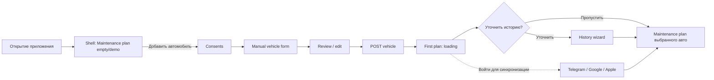

# UX-flow AutoDoctor MVP

**Основание:** [ТЗ MVP v1.0](../AutoDoctor_TZ_MVP.md)  
**Связанные документы:** [архитектура](architecture.md) · [модель данных](data-model.md) · [ADR мобильной архитектуры](adr/001-mobile-architecture.md)  
**Статус:** согласованный UX-flow

## Принципы первого запуска

- Приложение открывается без приглашения и регистрации.
- Первый экран — полноценный shell, а не onboarding-опросник.
- Shell сразу показывает навигацию, демо- и объясняющие состояния и основной CTA «Добавить автомобиль».
- Все разделы shell открываются без автомобиля и показывают собственный preview, а не перенаправляют пользователя на План обслуживания.
- До отправки профиля пользователь принимает обязательное согласие отдельно от необязательной аналитики.
- Гость может добавить автомобиль, получить план и продолжить локальную работу.
- Вход предлагается после первого плана или при включении облачной синхронизации.

## Критический flow

Целевой путь: **Open → Shell → `/garage/add` → `/garage/add/vin` → `/garage/add/confirm` → `POST /vehicles` → `/plan/first` → optional `/history/wizard` → `/roadmap`**. Первый результат строится по `by-pilot-baseline-2`; после него primary CTA — «Уточнить историю обслуживания», secondary — «Пропустить и открыть план». Auth — необязательная ветка после первого результата.

## Shell и навигация

Нижняя навигация фиксирована:

1. **План** / **Plan** — стартовый экран выбранного автомобиля с заголовком **План обслуживания** / **Maintenance plan**.
2. **Журнал** / **Journal** — общая хронология обслуживания, заправок и прочих расходов выбранного автомобиля.
3. **AI** — крупная центральная кнопка, открывающая последний активный тематический чат.
4. **Состояние** / **Condition** — сетка плиток ресурса/износа/инспекций (`/state`); Analytics не вкладка.
5. **Ещё** / **More** — аналитика (route `/analytics`), напоминания, обратная связь, настройки, согласия и синхронизация.

Garage отсутствует в нижней навигации и открывается из плашки активного автомобиля.

На всех основных и вложенных экранах сохраняется глобальная компактная однострочная шапка:

- слева — широкая кликабельная плашка активного автомобиля; без машины — CTA добавления;
- справа — колокольчик и круглый аватар;
- плашка открывает переключатель/Garage;
- колокольчик открывает историю уведомлений активной машины и личных документов;
- аватар открывает профиль; для гостя показаны силуэт и статус «Гость»;
- на вложенном экране действие возврата находится внутри заголовка контента и не заменяет глобальную шапку.

После переключения старые данные сразу убираются, затем показывается skeleton нового контекста; смешение данных разных машин недопустимо.

## Язык и локализация

- Поддерживаются русский и английский. Для пилота русский — default и fallback.
- В `Ещё → Настройки` / `More → Settings` расположен picker с вариантами `System / Russian / English` и локализованными подписями. Выбор сохраняется между запусками и немедленно применяется ко всему shell, открытому экрану, modal surfaces и accessibility tree.
- `System` использует поддерживаемый базовый язык системной локали; `ru-*` нормализуется в `ru`, `en-*` — в `en`, остальные значения переходят на русский.
- Все пользовательские строки, включая labels/hints/announcements экранного диктора, consent, errors, preview и empty states, поступают из ARB через `gen_l10n`. Отображаемый текст не является route, key сущности, machine code или аналитическим идентификатором.
- Клиент отправляет активную локаль и `Accept-Language`. API выбирает локаль по приоритету header → сохранённая локаль session → русский fallback с нормализацией до `ru`/`en`.
- Guest consent и безопасные ошибки имеют RU/EN варианты; machine codes, validation fields и `request_id` неизменны.
- Будущие названия maintenance catalog, системно сгенерированные заголовки и AI-ответы следуют активной локали. Проверенный технический источник не переводится автоматически, если это способно изменить смысл; AI safety outcome не зависит от языка.
- Даты, числа, единицы и валюты форматируются по активной локали на реализованных экранах. BYN, регион Беларусь и технические единицы не переводятся и не конвертируются с потерей смысла.

## Канонические экраны и состояния

- **План обслуживания / Maintenance plan — `/roadmap`**: стартовый экран. Плашка полноты истории → ближайшая работа → горизонтальная «дорога» 3–5 следующих событий → компактный список остального → mini analytics strip и CTA в `/analytics`. Unknown/unresolved items не попадают в future list как события плана. Rail расходников убран; quick access «Открыть Состояние». На узле — title, due, component icon и ровно два сигнала: `action_level` и `basis`. Legend и кнопка `+` сохранены.
- **Состояние / Condition — `/state`**: сетка 2×N плиток (интервал / износ / инспекция) с кольцевой диаграммой и кратким статусом; tap открывает detail sheet с lifecycle bar и действиями.
- **Garage / vehicle switch — `/garage` или modal sheet**: открывается из плашки автомобиля; карточки всех автомобилей, активный автомобиль, CTA добавления и серверный лимит. При лимите `1` объясняет ограничение; при конфигурации `2` разрешает вторую машину без обновления приложения.
- **Consents / start — `/garage/add`**: обязательное согласие до передачи профиля; отказ возвращает в Garage/shell, forward CTA «Продолжить» ведёт на ручную форму.
- **Manual vehicle form — `/garage/add/vin`**: порядок полей строго `марка → модель → год выпуска → двигатель (объём + топливо) → трансмиссия → пробег → VIN → дополнительные сведения`. Обязательны марка, модель, год, топливо и объём двигателя для non-electric; у electric объём отсутствует. Трансмиссия (`manual`/`automatic`), число передач, пробег, VIN, дата начала эксплуатации, поколение, код/мощность двигателя, привод и рынок необязательны. CTA «Проверить данные» ведёт на confirm. Кнопки или sheet «Собрать данные по VIN» в MVP нет; рядом с VIN показана подсказка, что VIN понадобится для будущего автоматического сбора данных и более точной идентификации комплектации.
- **Vehicle review — `/garage/add/confirm`**: полный read-back с действиями Back/«Редактировать» и forward CTA «Сохранить автомобиль». Сохранение вызывает только `POST /vehicles` с `Idempotency-Key`.
- **First plan — `/plan/first`**: state machine `loading → success | error`. Success показывает количество применимых пунктов и два CTA: primary «Уточнить историю обслуживания» и secondary «Пропустить и открыть план». Error сохраняет автомобиль и даёт retry; `409 PLAN_PREPARING` означает временную недоступность snapshot/ruleset.
- **Future VIN enrichment**: `/vehicles/decode` и `/vehicles/confirm` не имеют активных mobile routes, кнопок или sheet в этом срезе. Будущий UI показывает предложения по полям с source/url/as-of/confidence и применяет их только после явного accept.
- **Plan item — `/roadmap/items/:itemId`**: основание, пороги, источник, версия правила, неизвестные данные и безопасный следующий шаг; возврат расположен в заголовке контента.
- **Journal — `/journal`**: общая хронология фактических событий с фильтрами «Все / Обслуживание / Заправки / Прочие расходы» и действием «Добавить событие». `service_record` и `expense` остаются разными доменными сущностями. Без автомобиля показывает приглушённую структуру и CTA; с автомобилем показывает реальные service records либо честный empty state с созданием первой записи.
- **Add event sheet — modal bottom sheet**: варианты «Заправка / Обслуживание или ремонт / Другой расход / Обновить пробег»; выбор открывает соответствующую короткую форму.
- **Service record editor — `/service-records/new`**: `workCode` route/state optional. Из future event/consumable `Произвёл` он предзаполнен; из глобального `+` пользователь выбирает ровно одну работу. Дата по умолчанию сегодня, пробег — current confirmed mileage, оба редактируются; source `self`, note optional. Сохранение вызывает `POST /vehicles/{vehicleId}/history`. Это factual form, не history wizard.
- **History wizard — `/history/wizard`**: compact fields-first: на каждом узле сразу вопрос и поля (дата/пробег или износ). Действия всегда видны: «Сохранить и далее», «Не знаю», «Не относится», опционально «Никогда», skip all / finish later. Wear при сохранении пишет ConditionObservation. Batch `POST /vehicles/{vehicleId}/history-answers`.
- **Single-item history — `/history/wizard?workCode=:workCode`**: тот же form/state и тот же POST с одним элементом; открывается из side-sheet CTA «Указать историю» / «Изменить историю», prefill берётся из item-level `history_state`.
- **Expense editor — `/journal/expenses/new`, `/expenses/:id/edit`**: специализированная форма выбранного типа; сумма и дата обязательны для расхода. Для топлива поля «литры», «пробег», «полный бак» и «АЗС» необязательны, цена/литр вычисляется автоматически; пробег становится подтверждённой точкой только по явному согласию. Без автомобиля форма открывается с пустым disabled-селектором и недоступной кнопкой сохранения.
- **Mileage update — compact modal из current marker**: «Уточнить» открывает короткий ввод подтверждённого показания и времени. Сохранение вызывает отдельный `PUT /vehicles/{vehicleId}/mileage` с optimistic `version` и `Idempotency-Key`, не создаёт расход, service record или activity Журнала и после ответа обновляет current marker/plan. Снижение требует подтверждения и причины по API-контракту; первая mobile-версия может запретить снижение с ясным локализованным сообщением.
- **Analytics — `/analytics`**: подтверждённые суммы за текущий месяц и год, категории и динамика подтверждённого пробега. Fuel consumption и связанный топливный forecast появляются только при достаточных данных. Empty state не показывает фиктивные графики, числа или выводы.
- **AI chat — `/assistant`**: без автомобиля действует no-car gate. При активном автомобиле экран показывает выбранную машину и честное `feature_not_ready` / «AI пока не подключён»: без demo Q&A и CTA добавления автомобиля. Эта поставка не реализует AI backend, а только исправляет ложное vehicle state.
- **Notifications — `/notifications`**: без автомобиля — no-car объяснение и CTA; с автомобилем — empty/list state строго выбранной машины и личных документов, без текста добавления машины.
- **Profile — `/profile`**: аккаунт, настройки, вход/выход, управление данными и личные документы; для гостя — силуэт, статус «Гость» и вход.
- **Personal documents — `/profile/documents`**: название, дата окончания, необязательный маскированный номер; водительское удостоверение user-scoped, фото/сканы недоступны.
- **Vehicle card/documents — `/garage/:vehicleId`, `/garage/:vehicleId/documents`**: документы машины и полный список системных расходников; тот же список доступен в side-sheet плана обслуживания. Страховка vehicle-scoped, номер маскирован, фото/сканы недоступны. Пользовательского CRUD расходников в MVP нет.
- **Auth — `/auth`**: Telegram, Google и Apple; email/password не требуются. Возврат после успеха — на исходный экран.
- **More — `/more`**: точки входа в напоминания, feedback, настройки, согласия и облачную синхронизацию; профиль и личные документы открываются аватаром. В Settings доступен picker `System / Russian / English`.
- **Reminders — `/reminders`**: без автомобиля — preview/no-car CTA; с автомобилем до реализации — честное «Скоро» / `feature_not_ready`, без demo и no-car текста.

## Empty, demo и служебные состояния

- **Нет автомобилей:** План обслуживания объясняет ценность, показывает только явно маркированные примеры и CTA «Добавить автомобиль»; Garage показывает empty state без ошибки. План, Журнал, AI, Аналитика, «Ещё», Garage, напоминания и все формы остаются доступны.
- **Preview без автомобиля:** карточки имеют текстовую метку «Пример», приглушённый вид и недоступные действия. Они не являются рекомендациями, записями или уведомлениями; смысл disabled-state сообщается текстом и доступен экранному диктору.
- **Нет работ в Плане обслуживания:** без автомобиля показывается макет шкалы и CTA «Добавить автомобиль»; с автомобилем выполняется retry/ошибка подготовки, а не успешный пустой или demo-план.
- **Нет событий в Журнале:** без автомобиля показывается preview списка; с автомобилем — CTA «Добавить событие».
- **Инвариант активного автомобиля:** если глобальная шапка содержит `activeVehicle`, ни один screen/sheet не показывает `addVehicleFirst`, «нет выбранного автомобиля», «после добавления автомобиля», `Example`/demo content или CTA добавления автомобиля. Нереализованная feature возвращает `feature_not_ready`/честный empty state, но не fake no-car.
- **Нет данных Аналитики:** объяснить, какие подтверждённые события нужны; не показывать примерные суммы, графики, расход топлива или прогноз как данные автомобиля.
- **Недостаточно топливных данных:** скрыть fuel consumption и связанный топливный forecast и объяснить критерий доступности без подстановки усреднённых значений.
- **Нет системных расходников:** rail показывает нейтральное состояние без фиктивных эмблем, а side-sheet объясняет отсутствие применимых проверенных правил; не создавать пользовательские расходники и не выдумывать интервалы.
- **Interval-based расходник:** `done_known` показывает progress только по известным baseline legs и следующий известный срок по дате/пробегу; effective progress — максимум доступных долей. Для отсутствующего ответа, `done_unknown`, `not_done` и `unknown` показывает «История неизвестна — рекомендуем проверить/выполнить сейчас», без due/progress и без ложного overdue. `not_applicable` показывает «Не применимо».
- **Condition-based расходник:** qualitative items показывают последнее выполнение/проверку без процента. Для `brake_pads`, `brake_discs`, `tire_condition_inspection` expanded card позволяет добавить новое append observation `wear_percent`; рядом read-only показывается `remaining_percent=100-wear`. Без observation проценты не показываются. Wear не является OEM remaining life и не создаёт next due.
- **Overdue:** compact `action_level` вычисляется higher-wins mapping. Обычный `overdue` даёт `required`; `critical` допустим только при safety/immediate-сигнале.
- **AI без автомобиля:** no-car gate не создаёт API-запрос и предлагает добавить автомобиль. **AI с автомобилем:** выбранная машина видна, demo Q&A отсутствуют, показывается `feature_not_ready`; AI backend этой задачей не реализуется.
- **AI без тем:** создаётся первая тема по явному действию либо показывается CTA; постоянный пустой sidebar не отображается.
- **AI problem assessment:** вероятные причины имеют confidence; urgency, complexity и nullable cost не усредняются. Urgency `0` означает наблюдение, `5` — `do_not_drive`; complexity поясняет исполнителя, время и доступность деталей. Cost при наличии показывает score, BYN range, parts/labor, регион, дату, источник и confidence.
- **Критические признаки:** deterministic safety rules до модели формируют предупреждение для тормозов, рулевого управления, пожара и потери управления; предупреждение с текстом и иконкой расположено выше AI-ответа.
- **Смена машины в AI:** список тем, чат и черновик сразу меняются. In-flight ответ сохраняется в исходной теме исходной машины и не появляется в новом контексте.
- **Прогноз пробега:** широкий текст «примерно через 9–12 месяцев» визуально отличается от подтверждённой даты и не получает статус просрочки. При устаревании точки или достижении настраиваемой доли интервала показывается CTA «Уточнить пробег».
- **Документ без номера:** допустим; напоминание строится по дате окончания. Номер при наличии показывается маской. Загрузка фото/скана не предлагается.
- **Напоминания без автомобиля:** виден неактивный пример будущих событий с меткой «Пример»; локальное расписание не создаётся. С автомобилем до поставки feature — «Скоро», без demo badge.
- **Дата начала эксплуатации неизвестна:** показать «Точный срок по времени не рассчитан» и CTA уточнения; не выводить фиктивную дату.
- **Нет поддержанного плана:** универсальные рекомендации допустимы только с явным типом и источником; специфический регламент не выдумывается.
- **Manual pending review:** показывать `Профиль проверяется` / `Profile pending review`; доступны universal/type-level рекомендации, specific OEM regulation скрыт с объяснением требования curated/trusted подтверждения.
- **Источник baseline:** показывать «AutoDoctor Pilot Baseline v2», издателя «AutoDoctor Editorial» и явную подпись «Внутренняя редакционная методика, не OEM/руководство производителя». URL и verified OEM отсутствуют.
- **Предупреждения плана:** `EDITORIAL_BASELINE_ONLY` показывается всегда; `HISTORY_REQUIRED` — только если остаётся хотя бы один применимый non-`not_applicable` пункт без `done_known`; при неизвестном пробеге также `MILEAGE_NOT_PROVIDED`.
- **Quick-add:** без автомобиля locked/preview UI сохраняется. С автомобилем «Обслуживание или ремонт» открывает `/service-records/new`, где пользователь выбирает ровно одну работу; history wizard остаётся отдельным declaration flow.
- **VIN отсутствует:** профиль сохраняется нормально; рядом с полем объясняется, что будущий автоматический сбор данных и точная идентификация комплектации без VIN недоступны.
- **Пробег отсутствует:** не заявлять точность пробеговых рекомендаций или сроков roadmap; объяснить, что добавление пробега позволит уточнить рекомендации и временные окна.
- **Loading:** сохранять shell и выбранный автомобиль; блокировать только выполняемое действие.
- **Error:** сохранять ввод, давать «Повторить» и `request_id` в деталях; внутренние ошибки не показывать.
- **Offline:** последние локальные данные доступны; создание manual profile, серверный пересчёт и AI недоступны. Future VIN decode также требует сети.
- **Pending sync:** локальное изменение видно сразу с меткой; повторная отправка идемпотентна.
- **Future ambiguous VIN:** только варианты backend с provenance; без явного accept профиль не меняется. Это состояние не используется manual-first flow.

## Taxonomy и представление timeline

1. Каждый event получает ровно одну primary category для component icon: `maintenance_repair`, `parts`, `fuel`, `inspection`, `document`, `mileage`, `expense` или `reminder`.
2. Основной узел показывает краткое название, due, component icon и ровно два compact signals: `action_level` и `basis`.
3. `action_level`: `info`, `recommendation`, `attention`, `required`, `critical`. Mapping: `immediate|critical_attention` → `critical`; `high|overdue|requires_check_now` → `required`; `medium|soon` → `attention`; `recommended` → `recommendation`; остальные → `info`. Более высокий уровень побеждает.
4. `basis`: `confirmed`, `forecast`, `missing_data`. Source, history, category и исходные status/urgency/criticality/importance остаются в expanded detail.
5. Обычная просрочка не становится `critical`: без safety/immediate она даёт `required`.
6. Оба сигнала имеют RU/EN label, icon, semantics и цвет; цвет только дополнительный канал. Component icon остаётся, но не является третьим badge.
7. Один общий компактный legend перечисляет пять action levels и три basis states и объясняет higher-wins mapping.

## Доступность Плана обслуживания

- Rail и timeline являются отдельными scroll regions с понятными accessibility labels; порядок focus не перескакивает между ними неожиданно.
- Круглый элемент rail объявляет название расходника, тип состояния и доступное действие, а не только значение кольца или цвет.
- Side-sheet имеет modal semantics, заголовок, явную кнопку закрытия и focus trap. При закрытии через кнопку, scrim или системный Back focus возвращается на вызвавший элемент rail.
- Список side-sheet — accordion на месте: simultaneously expanded максимум одна строка. Expanded detail-card обязательно имеет отличный theme background и border; отдельный bottom description запрещён.
- Expanded interval card показывает last service, marker «Сейчас» и next due. Marker совпадает с концом выбранной displayed confirmed fraction: confirmed mileage leg при наличии динамики, иначе confirmed time leg. Обе due refs видимы. Display-only forecast может дать approximate next window, но никогда marker/status/overdue. Unknown не получает fake fill.
- Каждая future card имеет `Произвёл`, открывающий service form с выбранным `work_code`, today/current mileage. Hide/collapse и `Скрыть`/`Показать` исключены из активного MVP.
- Expanded numeric condition card показывает wear и remaining отдельно, позволяет append новое observation и окрашивает urgency по editorial thresholds: pads 70/85, discs 70/90, tires 60/80. Safety-critical high wear — danger/red; qualitative condition items остаются без процентов.
- Scrim и открытая панель не скрывают доступный способ закрытия. При крупном системном шрифте содержимое side-sheet прокручивается и не обрезает текст.
- `action_level` и `basis` передаются текстом, иконкой и цветом; экранный диктор читает текстовое значение.

## Проверки Плана обслуживания

- Проверить ширину rail 56–64 px, его свернутое начальное состояние и независимую прокрутку rail/timeline на минимально поддерживаемых Android и iOS.
- Проверить side-sheet на 80–85% ширины, отсутствие reflow/squeeze timeline, scrim, все способы закрытия, focus trap/return и screen-reader semantics.
- Проверить component icon и ровно два сигнала для past/future nodes.
- Таблично проверить deterministic higher-wins mapping всех action levels и basis states; overdue без safety/immediate должен быть `required`, не `critical`.
- Проверить interval-based confirmed legs и condition subset с фактическими wear/remaining; без observation fake % отсутствует.
- Проверить честную маркировку no-car/demo, отсутствие fake values и сохранение quick-add.
- Проверить accordion: максимум одна expanded row с distinct background/border; marker точно на конце preferred mileage либо fallback time fraction; forecast затрагивает только next window; unknown без fill.
- Проверить `Произвёл`, global quick-add и отсутствие hide/collapse действий и сетевых вызовов preferences.
- Проверить compact Plan: component icon сохраняется, оба сигнала имеют color/tooltip/semantics, один legend содержит только пять action levels и три basis states.
- На RU и EN проверить labels/hints/announcements rail, timeline, side-sheet, `action_level` и `basis`; переключение языка не должно менять focus, semantics roles или внутренний route `/roadmap`.

## Vehicle switch и защита контекста

1. Переключатель доступен из заголовка рабочего раздела.
2. Выбор обновляет `active_vehicle_id` локально и на сервере после входа.
3. План обслуживания, Журнал, Аналитика, напоминания и AI повторно загружаются с `vehicle_id`.
4. Deep link на сущность другой машины сначала переключает контекст после проверки доступа и только затем открывает экран.
5. При удалённом или недоступном автомобиле выбирается доступный автомобиль либо показывается Garage empty state.
6. Общей статистики по нескольким автомобилям вне Garage нет.
7. AI-темы и черновики ключуются по `vehicle_id`; отправленный запрос не переназначается после переключения.

## Прогноз пробега

1. Точки одометра поступают из ручного ввода, обслуживания и расходов/заправок и показывают источник.
2. При менее чем двух usable confirmed observations показывается явно маркированная default estimate: `10000 km/year`, low confidence. При двух и более показывается empirical estimate.
3. Новая подтверждённая точка пересчитывает прогноз.
4. Прогноз никогда не записывает текущий одометр, не создаёт observation, не ставит «просрочено» и не создаёт уведомление о работе.
5. При устаревании последней точки или прохождении настраиваемой доли интервала, стартово около 50%, показывается запрос уточнить пробег.
6. Календарный срок производителя отображается отдельно и не заменяется прогнозом.

## Порядок плана

1. Plan, future timeline и consumables используют один maintenance-v3 comparator.
2. Сначала unresolved/unknown service history; внутри неё `safety_critical`, затем `high`, затем остальные.
3. Затем resolved critical attention, `overdue`, `soon`, `current`; внутри — urgency, importance и earliest known due.
4. Полный tie-break — `work_code`, затем `id`. Past service events всегда выше marker.
5. Preference overlay в активном MVP отсутствует; никакая dormant preference не влияет на серверный или визуальный порядок, warnings и notifications.

## Auth и синхронизация

- Предложение входа не перекрывает First plan и закрывается действием «Позже».
- Второй триггер — включение облачной синхронизации в «Ещё».
- После Telegram/Google/Apple auth анонимные данные атомарно связываются с аккаунтом без дублей.
- Если серверный аккаунт и гость имеют автомобили, до слияния показывается безопасное подтверждение с учётом `max_vehicles_per_user`.
- Logout не удаляет серверные данные; удаление аккаунта и экспорт остаются отдельными подтверждаемыми действиями.

## Post-MVP: sharing и ownership transfer

Планируемые роли: `owner`, `editor`, `viewer`. При передаче владения новому owner переходит техническая история автомобиля, но не личные расходы, чеки, заметки, напоминания и AI-диалоги прежнего владельца. Прежний owner теряет доступ, если новый владелец не поделится автомобилем заново. В MVP экранов sharing и передачи владения нет.

## Навигационные guard-условия

1. Shell доступен всегда; отсутствие сессии не ведёт на invite или auth.
2. До отправки профиля обязательны актуальные согласия.
3. Нет активного автомобиля → все рабочие вкладки и формы остаются на выбранном route, показывают preview/disabled-state и CTA добавления автомобиля; redirect на План обслуживания или Garage не выполняется.
4. First plan показывается один раз после успешного добавления каждого автомобиля.
5. Auth открывается только по явному действию после успешного First plan, при включении синхронизации или восстановлении доступа.
6. AI и specific OEM regulation доступны только для доверенно подтверждённой конфигурации; pending-review manual профиль получает только universal/type-level content.
7. Все рабочие routes проверяют доступ к `vehicle_id` и соответствие активному автомобилю.
8. Каждый AI-запрос фиксирует исходные `vehicle_id` и `conversation_id`; смена активного автомобиля не меняет их.
9. Сохранение факта из AI-беседы требует отдельного явного пользовательского действия.
10. `activeVehicle != null` является UI-инвариантом для всех routes и modal surfaces: no-car/demo state недопустим независимо от loading/error/feature readiness.

## Регрессионная матрица active vehicle

- Notifications: no car → объяснение + CTA; active car → empty/list выбранной машины, без no-car текста.
- AI: no car → gate; active car → название машины + `feature_not_ready`, без demo Q&A и add-car CTA. AI backend не входит в эту поставку.
- Journal: no car → preview; active car → реальные service records или честный empty state + add service.
- Analytics: no car → preview; active car → empty/real state без demo badge и фиктивных значений.
- Reminders: no car → preview; active car → «Скоро»/`feature_not_ready`, без `Example`.
- Любой nested screen/sheet: при active car запрещены `addVehicleFirst`, «нет выбранного автомобиля», «после добавления автомобиля» и эквиваленты RU/EN.

## Приёмка Maintenance History v1

1. Матрица `by-pilot-baseline-2`: petrol/hybrid/lpg — 13 пунктов, diesel — 12, electric/other — 7; air filter имеет только 365 дней, condition-based пункты не имеют интервалов.
2. `done_known` interval использует только confirmed date/mileage legs; неизвестные/не выполненные ответы дают check-now без overdue. Numeric condition subset показывает percentage только из observation и никогда next due.
3. Roadmap реального автомобиля не имеет badge `Example`; side-sheet показывает полный API-список accordion и не более одной expanded card.
4. RU/EN меняют `title`, `basis` и warning explanations через `Accept-Language`, но не `work_code`, warning codes и identity.
5. Loading/success/error/retry покрыты widget/contract тестами; `409 PLAN_PREPARING` не удаляет сохранённый профиль.
6. Первый plan предлагает optional wizard; пропуск пункта/flow не блокирует `/roadmap`, сохранение reload-ит plan, а side-sheet редактирует тот же ответ одним item.
7. Quick-add различает no-vehicle и active-vehicle: maintenance открывает service-record form с обязательным выбором ровно одной работы; per-event `Произвёл` открывает ту же форму с prefill; history wizard остаётся declaration flow.
8. Current marker «Уточнить» создаёт только mileage observation, обновляет vehicle version и plan; expense/service activity не создаётся.
9. `POST /history` атомарно создаёт record/items, latest `done_known` answers, optional mileage observation и новый snapshot; GET возвращает chronology, timeline v3 — past service records.
10. Регрессионная матрица active vehicle проходит на RU/EN для screens и sheets; ложные no-car/demo строки отсутствуют.
11. Forecast default/empirical, v3 comparator, condition thresholds, недоступность dormant preference routes и единый legend двух сигналов проходят contract/widget tests.

## Приёмка manual-first профиля

1. Forward sequence и Back работают на всех пяти routes; повторный Back после успешного POST не создаёт дубликат.
2. После save глобальная шапка сразу показывает активный автомобиль по `make + model`, но никогда полный VIN.
3. Форма следует утверждённому порядку полей; displacement обязателен для petrol/diesel/hybrid/lpg и отсутствует для electric. Трансмиссия необязательна и в MVP UI ограничена `manual`/`automatic`; gears остаётся необязательным.
4. Ошибки `401/409/422` сохраняют ввод; stale-version conflict предлагает перезагрузить профиль, validation подсвечивает только стабильные field keys.
5. PATCH correction показывает сохранённый результат и version; неизвестные поля клиент не отправляет. Optional-поля могут быть очищены через `null`; backend объединяет PATCH с сохранённым состоянием и валидирует итоговый профиль. Снижение mileage направляется в отдельный flow с причиной.
6. RU/EN UI не локализует enum/API values и не отправляет VIN в analytics, crash breadcrumbs или debug logs.

## Каталог марки и модели

- Пилотный picker марки: `Volkswagen`, `Peugeot`, `Mitsubishi`, `BMW`, `Mercedes-Benz`, `Mazda`, `Other`.
- Модель выбирается из зависимого списка. `Other` открывает ручной ввод марки, `Other model` — ручной ввод модели.
- Начальный каталог моделей:
  - Volkswagen: Polo, Golf, Passat, Tiguan, Touareg, Jetta, Transporter;
  - Peugeot: 206, 207, 208, 307, 308, 3008, 5008, 508, Partner;
  - Mitsubishi: Colt, Lancer, Galant, ASX, Outlander, Eclipse Cross, Pajero, Pajero Sport;
  - BMW: 1 Series, 3 Series, 5 Series, 7 Series, X1, X3, X5, X6;
  - Mercedes-Benz: A-Class, C-Class, E-Class, S-Class, CLA, GLA, GLC, GLE, Vito, Sprinter;
  - Mazda: Mazda2, Mazda3, Mazda6, CX-3, CX-5, CX-7, CX-9, MX-5.
- Каталог — клиентская конфигурация/read model, а не DB enum. API принимает нормализованные строки `make` и `model` длиной до 100 символов.
- UI года — dropdown от текущего календарного года до 1980 включительно. Более широкий разумный диапазон API сохраняется; будущий ручной fallback UI не входит в этот срез.

## Приёмка локализации

1. Чистая установка с неподдерживаемой системной локалью открывается на русском; `System` корректно выбирает `ru` или `en` по базовому языку.
2. Picker в More/Settings переключает RU/EN без перезапуска и восстанавливает `system` / `ru` / `en` после повторного открытия приложения.
3. Все основные экраны, preview/empty/error/loading/offline состояния, guest consent и accessibility announcements проверяются на RU и EN без необработанных ARB keys и переполнений.
4. При смене языка пользователь остаётся на том же route и в том же vehicle/context; `/roadmap`, API endpoint names, machine codes и analytics events не меняются.
5. Запросы содержат активную локаль и `Accept-Language`; contract-проверки покрывают header/session/RU fallback и нормализацию `ru-BY`/`en-US`.
6. Одинаковые guest/API ошибки возвращают одинаковый machine code и `request_id` при локализованном message.
7. Эквивалентные RU/EN опасные симптомы дают одинаковый safety outcome; локализуется представление, а не правила.
8. Реализованные даты, числа, единицы и BYN проверяются в обеих локалях без ошибочного перевода региона или технической семантики.
